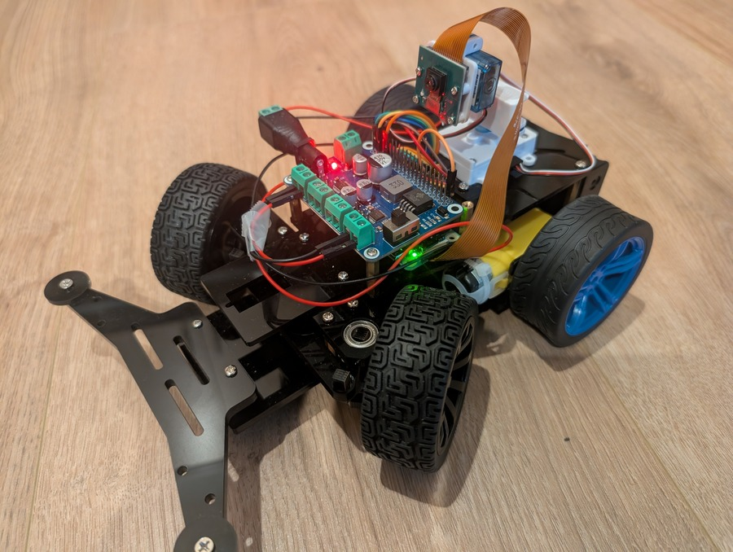
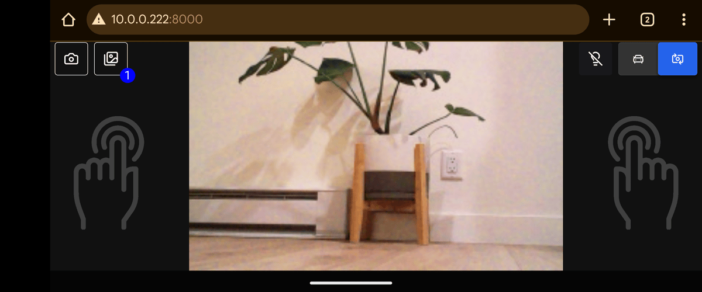
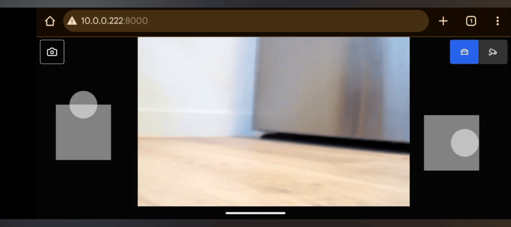

# Raspberry Pi Camera Car

This is a Raspberry Pi car with a tiltable and pannable camera controlled by a phone from anywhere in the world through the internet, using a live video feed and [virtual joysticks](https://github.com/yoannmoinet/nipplejs) on a web page. It's built with Python, Flask, Socket.IO, and React.
<br/><br/>
<p align="center">
  <a href="https://www.youtube.com/watch?v=jtcBjbbCzTw" target="_blank">
    
    <br/><br/>
    Watch a demo video
  </a>
  <br/><br/>
</p>

<p align="center">
  
  <br/><br/>
  Hold the phone sideways and place both thumbs on the screen to activate the virtual joysticks.
  <br/><br/>
</p>

<p align="center">
  
  <br/><br/>
  The left joystick makes the car/camera go forward/up or reverse/down, and the right joystick makes the car/camera turn left or right. The top right buttons toggle between moving the car and moving the camera. The top left button takes an HD photo. Photos are accessible from an album button to the right of the photo button, and each photo in the album opens up in a zoomable and pannable overlay controlled with multi finger gestures.
  <br/><br/>
</p>

## Features

- Low latency using websockets for both video streaming (20 FPS) and controls (25 MS responsiveness)
- Settings related to latency and video resolution can easily be configured
- Intuitive controls with virtual joysticks that allow variability in speed and turning radius
- Quickly toggle the UI between driving mode and camera platform position adjustment mode
- The virtual joysticks that control the car movement also control the tilt and pan of the camera
- Option to auto center the camera platform upon toggling back to driving mode
- Take HD photos and save them to an album whose photos can be viewed with phone gesture zooming and panning
- The entire thing, including the Raspberry Pi, is powered by rechargable batteries
- Can be controlled from anywhere in the world through the internet using ngrok (or locally on a WiFi network)

## How it works

The Raspberry Pi runs a Flask server with Socket.IO / gevent integration, accepting websocket messages to control the movement of the car. The GPIO is integrated through the Python interface to control the steering servo, rear wheel motors, and the camera platform servo positions. The live feed of the camera is served to the frontend through the websocket as a series of low resolution JPG images at 20 frames per second, optimized for low latency. Using ngrok, port 8000 is opened up to traffic, allowing the car to be controlled through the internet, with optional password protection.

The frontend is a React application with two virtual joysticks. The left joystick operates on the vertical plane and controls the forward and reverse motion of the car and the tilt of the camera. The right joystick operates on the horizontal plane and controls the steering of the car and the pan of the camera. The speed and steering radius of the car are directly correlated with the force applied to the virtual joysticks. Joystick control data is emitted to the server every 25 milliseconds to continously sync the car's speed and servo positions, providing a responsive experience.

The photo button, on the top left, takes an HD photo, which gets saved on the Raspberry Pi in a dedicated folder / album. The photos in this album can be viewed, zoomed, and panned through the UI. The camera always initializes two streams - one low resolution stream that handles the continuous video feed, and another high resolution stream to handle the snapshots that can be taken and saved in this album.

## Parts List

- [Raspberry Pi Zero 2 WH (3, 4, 5 would also probably work)](https://www.amazon.com/dp/B0DRRDJKDV)
- [LK Cokoino 4WD robot hat shield](https://www.amazon.com/dp/B0D4VYW1PX)
- [LK Cokoino rear-wheel drive robot car chassis with servo](https://www.amazon.com/dp/B0FC2X2LVZ)
- [Arducam camera module](https://www.amazon.com/dp/B01LY05LOE)
- [Arducam camera pan tilt platform](https://www.amazon.com/dp/B08PK9N9T4)
- [18650 2-battery pack with charger](https://www.amazon.com/dp/B0FQ9QQ64K)
- [Dupont jumper wires](https://www.amazon.com/dp/B0BRTHR2RL)
- [Power jack adapter barrel connector](https://www.amazon.com/dp/B0CR8TZ41W)
- [64 GB Micro SD card (could be any size larger than 8GB)](https://www.amazon.com/dp/B0DRRDJKDV)
- [USB C Micro SD card reader](https://www.amazon.com/dp/B0F1G1TNDS)

## How to install

### Hardware

1. Follow the instructions for the robot car chassis assembly using Demo2 (Robot HAT)
2. Attach the camera to the Raspberry Pi with the ribbon cable
3. Follow the instructions for the camera pan tilt platform assembly, attach it to the Raspberry Pi's GPIO, and mount the platform on the car

### Software

It's easiest to set the WiFi network name and password in the imaging software used to flash the micro SD card with the OS so you won't need a mouse, keyboard, and monitor for the pi, and you can instead SSH into it to execute the instructions below.

1. Clone this repository on the Raspberry Pi

    `git clone https://github.com/diracleo/pi-camera-car.git`

2. Go into the repository directory

    `cd pi-camera-car`

3. Install (will reboot at the end)

    `sudo make install`

#### Optional extra steps to setup for control through the internet

4. [Sign up for an ngrok account](https://ngrok.com/)

5. [Install and activate ngrok on the Raspberry Pi](https://ngrok.com/download/raspberry-pi)

## How to run locally

1. Start the flask application

    `make start`

2. On your phone, while on the same WiFi network as the Raspberry Pi, open a browser and navigate to the URL

    `http://<IP ADDRESS OF PI>:8000`

## How to run through the internet

This requires that you did optional steps 4 and 5 from the software installation section.

1. Start ngrok and the flask application

    `make start-public`

2. Get the publicly accessible URL

    `make get-url`

3. On your phone, open a browser and navigate to the URL displayed from step 2

4. When you're done, run the stop command to close internet access and stop the flask application

    `make stop`

## Starting the car on boot

Even though running the flask server is just a single command, it's inconvenient because it requires first SSH'ing into the Raspberry Pi (it's a pain to connect a mouse, keyboard, and monitor to a Raspberry Pi that's mounted on a robot car), which is why I recommend creating a service through systemctl to automatically start the flask server on boot. After these steps, every time you flip the switch to turn the car on, it will start up the flask server and be ready for you to control the car with your phone within a minute.

1. Create the service file

    `sudo nano /etc/systemd/system/car.service`

    Add these contents to the file, replacing USER with your user. This example starts in local WiFi mode. If you want to start in public internet access mode, change `ExecStart` to reference the file `start_public_exec`.

    ```
    [Unit]
    Description=Pi Camera Car
    After=network.target

    [Service]
    WorkingDirectory=/home/USER/pi-camera-car
    ExecStart=/home/USER/pi-camera-car/start_exec
    Type=forking
    User=USER

    [Install]
    WantedBy=multi-user.target
    ```

2. Restart the daemon

    `sudo systemctl daemon-reload`

3. Enable the service

    `sudo systemctl enable car.service`

## Protecting the controlling of the car with a password

Especially when opening up controls to the internet, you should set the `PASSWORD` in `backend/app.py` to prevent unauthorized access.

## How to modify the code

It's probably easiest to fork this repository and do development on a different machine than the Raspberry Pi. You can push to your forked repository from that machine, and then you can pull the changes on the Raspberry Pi using SSH.

### Frontend

The frontend is a React app bundled by Vite.

1. Go into the frontend directory and start the development server

    `cd frontend`

    `npm run dev`

2. Make changes to `App.jsx` and test them at the URL displayed in the console

3. When you're done, press `ctrl + c`

4. Build the production bundle

    `npm run build`

5. Commit and push your changes to your forked repository

5. Pull those changes onto the Raspberry Pi (the production build directory, `dist`, should be included in those changes, as it was intentionally excluded from the `.gitignore` file)

### Backend

The backend is a Flask application in `backend/app.py`. You can modify this file as you need to, and then re-run `make start` to see the changes.

## Using different hardware

The software architecture will support a variety of hardware configurations, whether it's a different robot car chassis or motor driver, and it may just be a matter of changing the GPIO interface in `backend/app.py` to use different pins. The basic premise is that the backend streams video from the camera to the frontend through the websocket, and the frontend sends messages through the websocket that contain the throttle and steering values, and the backend processes them however it wants to.
